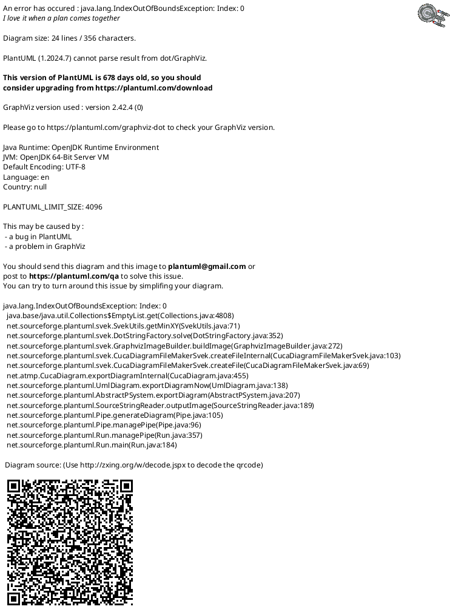

# [PlantUML](https://plantuml.com/zh/) 在 [vscode](https://code.visualstudio.com/) 中的使用

## 1. 什么是 UML ？

UML —— 统一建模语言（Unified Modeling Language）是非专利的第三代建模和规约语言。

UML是一种开放的方法，用于说明、可视化、构建和编写一个正在开发的、面向对象的、软件密集系统的制品的开放方法。

UML展现了一系列最佳工程实践，这些最佳实践在对大规模，复杂系统进行建模方面，特别是在软件架构层次已经被验证有效。

### 1.1 UML 的历史

1. 1994 年： UML 可以追溯到 1994 年，[Rational Software](https://www.rationalenterprise.com/) 公司的工程师最早开发出来的语言，后来这个公司开发了 [Rational Rose](https://www.ibm.com/support/pages/ibm-rational-rose-enterprise-7004-ifix001) 这种面向对象的统一建模语言的可视化建模工具。用于可视化建模和公司级水平软件应用的组件构造。
2. 1997 年： UML 被对象管理组织接纳为标准，并在此之后受该组织管理。
3. 2005 年： UML 被国际标准化组织接纳为一种标准，自此，该标准被定期修订以涵盖 UML 的最新版本。

虽然这是一个标准语言，但是大部分情况下，开发者并不会去使用 UML，而是去自己产生非标准的手绘。但是值得庆幸的是，很多非标准的手绘中都有 UML 的元素。

## 2. UML 基本概念

UML 中划分为 模型 和 图形 两大类。

### 2.1 模型

在 UML 系统开发中有三个主要的模型，功能模型、对象模型和动态模型：


### 2.2 图形

UML 2.2 中一共定义了 14 种图示：

1. 结构性图形，强调系统式的建模：
    - 静态图：
        - 类图：描述系统的类集合，类的属性和类之间的关系。
        - 对象图：显示特定时间，建模系统结构的完整或部分视图的图。
        - 包图：描述了构成模型的包之间的依赖关系。
    - 实现图：
        - 组件图：如何互相组织以构建更大的组件或是软件系统的。
        - 部署图：对节点（硬件组件）上工件（软件组件）的物理部署（包括连接方式）进行建模。
    - 剖面图：元模型（metamodel）的层次说明，用来说明内部的构造。
    - 复合结构图：也叫组合结构图，“结构”是指元素之间的相互连接，实例通过通信连接合作以实现某目的。

2. 行为式图形，强调系统模型中触发的事件：
    - 活动图：用于为计算性和组织性过程（即工作流）建模，相关活动之间的数据流也在其覆盖范围之内。
    - 状态图：对象在其生存期间的动态行为，表现为对象所经历的状态序列，引起状态转移的事件，以及因状态转移而伴随的动作。
    - 用例图：用户与系统交互的最简表示形式，展现了用户和与他相关的用例之间的关系。

3. 交互性图形，**属于 行为图形 的子集合**，强调系统模型中的资料流程:
    - 通信图：也叫协作图，根据顺序消息对对象或部分之间的交互进行建模。
    - 交互概述图（UML 2.0）：描述用例的正常流与替代流之间的关系，作为内部协作图。在活动图的基础上，使用“交互框”作为元素，替代活动图中的“活动”。交互框间以“控制流”连接。
    - 时序图（UML 2.0）：描述物件在时间序列中的交叉作用。
    - 时间图（UML 2.0）：一种特定类型的交互图，其重点是时序约束。探索对象在给定时间段内的行为。时序图是序列图的一种特殊形式。时序图和时序图的区别在于轴是颠倒的。

14 中 UML 图表一览：


### 2.3 模型和图形的区别

1. UML 图，包括：用例图、协作图、活动图、序列图、部署图、构件图、类图、状态图，是 **模型中信息的图形表达方式，但是 UML 模型独立于 UML 图存在**。

2. UML 的当前版本（UML 2.2）只提供了模型信息的交换，而没有提供图信息的交换。

## 3. PlantUML

### 3.1 支持 9 种 UML 图形

1. PlantUML 支持的 9 种 UML 图形，在上图中已经用天蓝色标注出来了，分别是：

[类图](https://plantuml.com/zh/class-diagram)、[对象图](https://plantuml.com/zh/object-diagram)、[组件图](https://plantuml.com/zh/component-diagram)、[部署图](https://plantuml.com/zh/deployment-diagram)、[活动图](https://plantuml.com/zh/activity-diagram-legacy)、[状态图](https://plantuml.com/zh/state-diagram)、[用例图](https://plantuml.com/zh/use-case-diagram)、[时序图](https://plantuml.com/zh/sequence-diagram)、[时间图](https://plantuml.com/zh/timing-diagram)。


2. PlantUML 中使用 UML 的语法结构：

```UML
@startuml
图形代码段
不同的图例，使用不同的符号或者关键字表示
@enduml
```

3. 其他支持：
    a. 也支持其他常用的图形：
        - [思维导图](https://plantuml.com/zh/mindmap-diagram)
        - [甘特图](https://plantuml.com/zh/gantt-diagram)
        - [WBS —— 工作分解结构](https://plantuml.com/zh/wbs-diagram)
    b. 常用协议配置的支持
        - [Json](https://plantuml.com/zh/json)
        - [YAML](https://plantuml.com/zh/yaml)

### 3.2 支持的文件格式

支持的文件格式有以下几种 ：`*.wsd`、`*.pu`、`*.puml`、`*.plantuml`、`*.iuml`。（`*.wsd` —— 由 WordStar 创建的文档，目前该软件几乎没人使用。）

在 vscode 中，以上 5 中文件格式 UML 图，都可以显示，但是 **在编辑过程中 `*.pu`、`*.puml`、`*.plantuml` 三种格式是支持实时预览的**：


使用文本格式编辑，通过 `Alt + D` 快捷键预览 PlantUML 图表，**需要注意的是，**`Alt + D` 时光标必须在图表代码段内** ：


所以，**建议选取 `*.pu`、`*.puml`、`*.plantuml` 之一作为 PlantUML 文件名后缀。**

### 3.3 在 Markdown 文件中的支持

以安装了 PlantUML 插件和 Markdown 的 vscode 为例，在 Markdown 文件中输入如下 PlantUML 代码段：

```plantumlcode
@startmindmap
* A
** A.1
*** A.1.1
** B
*** B.1
** C
*** C.1
@endmindmap
```

预览效果如下：


## 4. UML 的开发软件

### 4.1 UML 开发软件

最为传统的有两个：

1. [IBM Rational Rose Enterprise Edition](https://www.ibm.com/support/pages/ibm-rational-rose-enterprise-7004-ifix001)，这是标准的 UML 开发工具。
2. [Microsoft Visio](https://www.microsoft.com/zh-cn/microsoft-365/visio/flowchart-software)，是一款流程图软件工具和画图软件。

现在已经有很多第三方的（且免费的） UML 建模工具，今天我们主要要聊的就是 [PlantUML](https://plantuml.com/zh/) 这种用代码方式替代拖拖拽拽画 UML 图例的方式。

### 4.2 [vscode](https://code.visualstudio.com/) 中安装 [PlantUML](https://plantuml.com/zh/)

1. 安装 [vscode](https://code.visualstudio.com/)， 假如你还没有的话，可以去 [官网下载](https://code.visualstudio.com/) 下载并安装。
2. 安装 PlantUML:
   2.1 打开网页版 [PlantUML](https://marketplace.visualstudio.com/items?itemName=jebbs.plantuml)，选择 安装也可以：
   

   2.2 打开 vscode，打开插件管理（可以通过快捷键 `Ctrl+Shift+X` 打开），搜索 `plantuml` 安装 PlantUML 插件：

   

   2.3 打开 vscode，`Ctrl+p` 打开全局搜索，输入 `ext install plantuml`，选择 `PlantUML` 下 `安装` 按钮点击即可安装。

### 4.3 vscode 中的快捷键

1. `Alt + D` 预览 PlantUML 当前图表；
2. `Ctrl + P` 打开命令行模式，输入 `>plantuml` 可以查看更多导出功能：


## 5. PlantUML 中 UML 图形使用介绍

这里将依次介绍 9 中 UML 图例的 PlantUML 常用语法（详情请见[官方文档](https://plantuml.com/zh/sitemap-language-specification)）。

### 5.1 [类图](https://plantuml.com/zh/class-diagram)

描述系统的类集合，类的属性和类之间的关系。

1. 通用图例一览

```plantumlcode
@startuml
()   圆
<>   菱形
..   表示虚线
--   表示实线
@enduml
```

#### 5.1.1 元素声明

```plantumlcode
@startuml
abstract        抽象
abstract class  抽象(等同abstract)
annotation      注解
circle          圆
()              圆缩写形式
class           类
diamond         菱形
<>              菱形写形式
entity          实例
enum            枚举
interface       接口

Car <|- Bus     扩展
Car *-- Tire    组合
Bus o-- Driver  聚合

在关系之间使用标签来说明时, 使用 : 后接 标签文字。

对元素的说明，你可以在每一边使用 "" 来说明。

在标签的开始或结束位置添加 < 或 > 以表明是哪个对象作用到哪个对象上。
@enduml
```

图1-1 类图基本元素


#### 5.1.2 扩展类用法

```plantumlcode
@startuml
要声明字段和方法，你可以使用符号 : 后面跟着字段或方法的名称。也可以在大括号之间分组 {} 所有字段和方法。

访问权限（方法是实心、变量是空心）：
    - 正方形 私有
    # 菱形   保护
    ~ 三角形 包/类的私有
    + 圆形   公开

可以采用命令 skinparam classAttributeIconSize 0 来展示特殊符号本身。

模板通过类关键字（ "<<" 和 ">>" ）来定义

可以使用 note left of , note right of , note top of , note bottom of 这些关键字来添加备注。
你还可以在类的声明末尾使用 note left, note right,note top, note bottom来 添加备注。
此外，单独用 note 这个关键字也是可以的，使用 .. 符号可以作出一条连接它与其它对象的虚线。

你可以用 < 和 > 来定义类的泛型。
@enduml
```

图1-2 类图扩展用法


图1-3 显示访问权限文本


图1-4 泛型


#### 5.1.3 箭头方向

```plantumlcode
类之间默认采用两个破折号 -- 显示出垂直 方向的线，要得到水平方向的可以像这样使用单破折号 (或者点)。

可以通过改变倒置链接来改变方向

可通过在箭头内部使用关键字， 例如 left, right, up 或者 down，来改变方向

也支持 left to right direction 参数
@enduml
```

图1-5 箭头方向


#### 5.1.4 分组继承关系

```plantumlcode
@startuml
可以合并所有的箭头，使用 skinparam groupInheritance, 用阈值(第几组)作为参数。
@enduml
```

图1-6 [分组继承关系](http://www.plantuml.com/plantuml/uml/SoWkIImgAStDuIhEpimhI2nAp5L8ByelBV3CoqWjoYn9p4jELJ3aud8qLB2fqTLLS0AnZQ1i8pZJsGWeR0mLDeOpdH5C5sEW2XEe2XCuqnd1T44mNKsu75BpKa3E0W00)


### 5.2 [对象图](https://plantuml.com/zh/object-diagram)

显示特定时间，建模系统结构的完整或部分视图的图。

#### 5.2.1 对象的基本定义

```plantumlcode
@startuml
使用关键字 object 定义实例。

对象的关系：
    <|- 扩展
    *-- 组合
    o-- 聚合

关联对象可以使用  diamond <> 来进行

用冒号加属性名的形式声明属性。
@enduml
```

图2-1 对象的基本定义


#### 5.2.2 关联数据的显示（map）

```plantumlcode
@startuml
可以通过 => 来左右连接 map 的 key 和 value， 来展示关联数据。

也可以使用 --> 在对象定义外关联对象 *-> 在对象定义内来关联对象

--> 表示水平的关联线条  -> 表示垂直的关联线条
@enduml
```

图2-2 关联数据的显示


### 5.3 [组件图](https://plantuml.com/zh/component-diagram)

如何互相组织以构建更大的组件或是软件系统的。

#### 5.3.1 组件图的基本定义

```plantumlcode
@startuml
组件：必须用 [] 括起来或者使用 component 定义一个组件。
接口：用 () 括起来或者使用 interface 定义一个接口。

可以用关键字 as 给组件/接口定义一个别名。

元素之间可以使用线条连接：
    .. 虚线
    -- 直线
    -> 箭头
@enduml
```

图3-1 组件图的基本定义


#### 5.3.2 组件图的高级用法

```plantumlcode
@startuml
可以使用多个关键字将组件和接口组合起来，包括 ： package node folder frame cloud database

命令 skinparam componentStyle uml1 可以切换到 UML1 标记符。
命令 skinparam componentStyle rectangle 使用长方形去表示组件。

可以用方括号 [] 在连线上添加描述。

hide @unlinked 或 remove @unlinked 可以隐藏没事用到的组件或者接口。
@enduml
```

图3-2 组件图多关键字的组合


### 5.4 [部署图](https://plantuml.com/zh/deployment-diagram)

对节点（硬件组件）上工件（软件组件）的物理部署（包括连接方式）进行建模。

```plantumlcode
@startuml

@enduml
```

```plantuml
@startuml

@enduml
```

### 5.5 [活动图](https://plantuml.com/zh/activity-diagram-legacy)

用于为计算性和组织性过程（即工作流）建模，相关活动之间的数据流也在其覆盖范围之内。

#### 5.5.1 活动图的基本描述

```plantumlcode
@startuml
使用 (*) 作为活动图的开始点和结束点。

用 (*top) 强制开始点位于图示的顶端。

使用 --> 绘制箭头， [] 在 箭头后可以增加标签信息。

改变箭头方向：
    -down->  (默认箭头)
    -right-> or -->
    -left->
    -up->
@enduml
```

图5-1 活动图示例


#### 5.5.2 分支控制

```plantumlcode
@startuml
使用关键字 if/then/else/endif 创建分支。

使用 ===code=== 来显示同步条。

定义活动时可以用 \n 来定义跨越多行的描述。

用关键字 partition 定义分区，还可以设置背景色(用颜色名或者颜色值)。
@enduml
```

图5-2 分支控制


### 5.6 [状态图](https://plantuml.com/zh/state-diagram)

对象在其生存期间的动态行为，表现为对象所经历的状态序列，引起状态转移的事件，以及因状态转移而伴随的动作。

#### 5.6.1 状态图的基本描述

```plantumlcode
@startuml
使用 [*] 开始和结束状态图

关键字 state 定义长名字状态。

使用 hide empty description 关键字，渲染一个简单的状态。

一个状态也可能是合成的，必须使用关键字state和花括号来定义合成状态。

[H] 表示历史记录，[H*] 表示子状态的深层历史记录。

用 -- or || 作为分隔符来合成并发状态。

常用关键字：
    <<start>>  表示开始
    <<end>>    表示结束
    <<fork>>   表示状态的复制
    <<join>>   表示状态的统一。
    <<choice>> 进行分支选择
@enduml
```

图6-1 状态图示例


#### 5.6.2 状态图其他语法

```plantumlcode
@startuml

指针关键字 <<entryPoint>> <<exitPoint>>
固定关键字 <<inputPin>> <<outputPin>>
扩展关键字 <<expansionInput>> <<expansionOutput>>

note on link/end note 可以用来描述状态连线或链接
@enduml
```

图6-2 状态图其他语法



### 5.7 [用例图](https://plantuml.com/zh/use-case-diagram)

用户与系统交互的最简表示形式，展现了用户和与他相关的用例之间的关系。

```plantumlcode
@startuml

@enduml
```

```plantuml
@startuml

@enduml
```

### 5.8 [时序图](https://plantuml.com/zh/sequence-diagram)

描述物件在时间序列中的交叉作用。

### 5.8.1 时序图基本概念

```plantumlcode
@startuml
序列 --> 用于绘制两个 参与者之间的信息。 参与者不必明确声明。
在序列图中 <- <-- 只是表示消息的方向，并不改变绘图。

参与者类型 8 种：
    participant 参与者
    actor       角色
    boundary    边界
    control     控制
    entity      实体
    database    数据库
    collections 集合
    queue       队列

可以使用 order 关键字来定制参与者的显示顺序。

消息文字可以用 \n 来换行。
@enduml
```

图8-1 时序图基本概念

```plantuml
@startuml
title 时序图基本概念-C81

actor Alic #red

Alic ->  Bob  : 授权请求
Bob  --> Alic : 授权返回

Alic ->  Bob  : 另外一个授权请求
Alic <-- Bob  : 另外一个授权返回一
Alic <-  Bob  : 另外一个授权返回二

participant 参与者 [
    =姓
    ---
    ""名字""
]

participant 参与者 as a1 #99FF99
actor       角色   as a2 order 1
boundary    边界   as a3
control     控制   as a4
entity      实体   as a5
database    数据库 as a6
collections 集合   as a7 order 2
queue       队列   as a8
a1 --> a1 : 自己给自己发消息
a1 ->  a2 : To actor \nnew line
a1 --> a3 : To boundary
a4 <-  a1 : To control
a5 <-- a1 : To entity
a1 --> a6 : To database
a1 --> a7 : To collections
a1 --> a8 : To queue
@enduml
```

#### 5.8.2 一些特殊的用法

```plantumlcode
@startuml
使用 skinparam responseMessageBelowArrow true 命令，让响应信息显示在箭头下面。

改变箭头样式：
    > 后添加 x       表示信息丢弃
    / \ 而不是 < >   表示只有箭头的底部或者顶部
    重复箭头头       表示一个尖头箭头，比如 >> << // \\
    --               表示点状的箭头
    -                表示实线的箭头
    在箭头头最后添加 o  表示一个带头部带端的箭头
    <->                 表示双向箭头

关键字 autonumber 用于自动对消息编号。
语句 autonumber //start// 用于指定编号的初始值，而 autonumber //start// //increment// 可以同时指定编号的初始值和每次增加的值。
语句 autonumber stop 和 autonumber resume //increment// //format// 来表示暂停或继续使用自动编号。

关键字 newpage 用于把一张图分割成多张。

使用 note left 或 note right 关键字在信息后面加上注释。 使用 end note 关键字有一个多行注释。

note across: 备注描述 所有参与者之间添加备注

hnote rnote 改变备注的描述为六边形、正方形
@enduml
```

图8-2 一些特殊的用法

```plantuml
title 一些特殊的用法-C82

skinparam responseMessageBelowArrow true
autonumber

note across : "所有参与者一起备注"

A -> B : request
B --> A : reponse

A -[#red]>x B : 丢弃消息
A -\  B : 顶部箭头
A -/  B : 底部箭头
A ->> B : 尖头箭头

note left : "`newpage` 可以把同一个图分页显示"

autonumber 10 "<b>[00]"
A -\\ B : 顶部尖头箭头
note right : "右侧注释"
A -// B : 底部尖头箭头
note left
多行注释
第二行
end note
A --> B : 点状箭头
hnote over A : 六边形描述
autonumber stop
A ->  B : 实线箭头
rnote over B
    多行
    文本
    描述
endrnote

autonumber 40 5 "<b>(<u>##</u>)"
A <-> B : 双向箭头
A ->o B : 带端的箭头
@enduml
```

### 5.9 [时间图](https://plantuml.com/zh/timing-diagram)

一种特定类型的交互图，其重点是时序约束。探索对象在给定时间段内的行为。时序图是序列图的一种特殊形式。时序图和时序图的区别在于轴是颠倒的。

#### 5.9.1 时间图的基本描述

```plantumlcode
@startuml
使用 concise 或 robust 关键字声明参与者, 选择哪个取决于所需的显示样式。
通过 @ 标注, 和 is 动词定义状态。

可以使用 @ 符号表示相对时间.

使用 --> 描述消息

以通过使用 as 关键字和以: 开始的名称来定义一个时间作为锚点。

has 可以定义状态
@enduml
```

图9-1 时间图基本概念

```plantuml
@startuml
title 时间图基本概念-C91

robust  "Web 浏览器" as wb
concise "Web 用户"   as wu

wb is 初始化
wu is 暂无

wb has start,process,end

@500 as :end

@0 as :start
wb is 空闲
wu is 空闲

@wb
wb@0 <--> @50 : {50 ms long}

@+100
wu -> wb: URL
wu is 等待中
wb is 处理中

@300
wb is 等待中

@:end
wu is 空闲
@enduml
```

#### 5.9.2 时间图的其他描述

```plantumlcode
@startuml
关键字 binary clock 可以绘制二进制及时钟信号。

也选择添加：
    title              标题
    header             页眉
    footer             页脚
    caption            图例
    legend/end lengend 说明
@enduml
```

图9-2 时间图的其他描述

```plantuml
@startuml
title 时间图的其他描述-C92

header  页眉
footer  页脚
caption 图例

legend
    一些说明文字
end legend

clock clk with period 2
binary "开启" as EN

@0
EN is 高电压

@5
EN is 高电压

@10
EN is 高电压
@enduml
```
