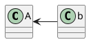
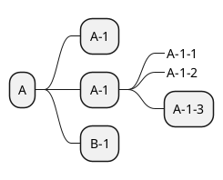
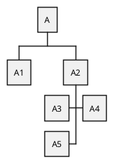

## markdown with uml


```plantumlcode
@startuml
class A
class B
A <..B
@enduml
```


```plantuml
@startuml
class A
class b
A <-b
@enduml
```

### 1.1 思维导图


```plantuml
@startmindmap
* A
** A-1
** A-1
***_ A-1-1
***_ A-1-2
*** A-1-3
** B-1
@endmindmap
```

### 1.2 wbs


```plantuml
@startwbs
* A
** A1
** A2
***< A3
***> A4
***< A5
@endwbs
```

### 1.3 类图


```plantuml
@startuml
() 圆形
<>  菱形

@enduml
```

### 1.4 时序图
